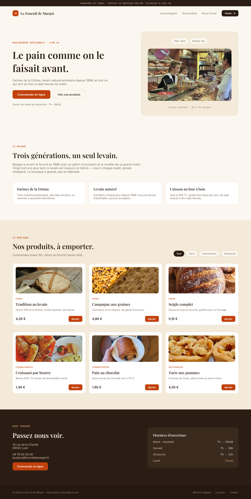

# boulangerie — Le Fournil de Margot

Site vitrine d'une boulangerie artisanale fictive, avec sa **section boutique** :
six produits en grille, filtres par categorie, prix et boutons d'ajout.

## Sections

bandeau d'annonce · navigation avec panier · heros · presentation de la maison
(trois valeurs) · **boutique** (Pains, Viennoiseries, Patisseries) · informations
pratiques et horaires · pied de page.

## Direction

Palette chaleureuse et artisanale : fond creme `#FBF7F0`, texte brun profond
`#2B1D14`, terracotta `#C2410C` reserve aux actions. Titres en Playfair Display,
corps en Inter.

## Photos

| Emplacement | Auteur | Licence | Source |
|---|---|---|---|
| `tradition` | Jarkko Laine | BY 2.0 | [Another shot at the bread baked in the ad hoc oven](https://www.flickr.com/photos/87308984@N00/7399880790) |
| `campagne` | Thad Zajdowicz | BY 2.0 | [Nine-Grain Sourdough Bread -- HMM -- Explored 22 Aug](https://www.flickr.com/photos/40632439@N00/36655400146) |
| `tarte` | jeffreyw | BY 2.0 | [Mmm...cookie dough apple tarts](https://www.flickr.com/photos/7927684@N03/5065477191) |
| `hero` | anonyme | CC BY-SA 3.0 de | [Bundesarchiv B 145 Bild-F079097-0017, Göttingen, Bäc](https://commons.wikimedia.org/wiki/File:Bundesarchiv_B_145_Bild-F079097-0017,_G%C3%B6ttingen,_B%C3%A4ckerei.jpg) |
| `seigle` | Tarasna0922 | CC BY-SA 4.0 | [A loaf of wheat and rye bread.jpg](https://commons.wikimedia.org/wiki/File:A_loaf_of_wheat_and_rye_bread.jpg) |
| `chocolat` | Andy Li | CC0 | [Pain Au Chocolat - Caffè Nero 2026-01-04.jpg](https://commons.wikimedia.org/wiki/File:Pain_Au_Chocolat_-_Caff%C3%A8_Nero_2026-01-04.jpg) |
| `croissant` | Debbie Tingzon from Doha, Qatar | CC BY 2.0 | [American Breakfast (28188218105).jpg](https://commons.wikimedia.org/wiki/File:American_Breakfast_(28188218105).jpg) |

## Apercu

### Site vitrine

## Fichiers

- `design.pen` — source pen.dev
- `screenshots/boulangerie.png` — rendu 1440 × 2859
- `screenshots/boulangerie-vitrine.pdf`
- `screenshots/boulangerie-vitrine.html` — export HTML autonome
