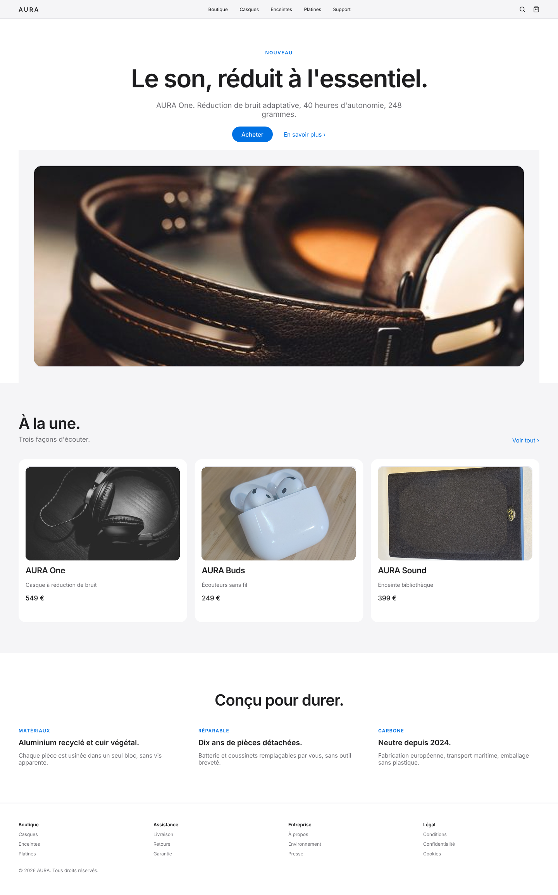
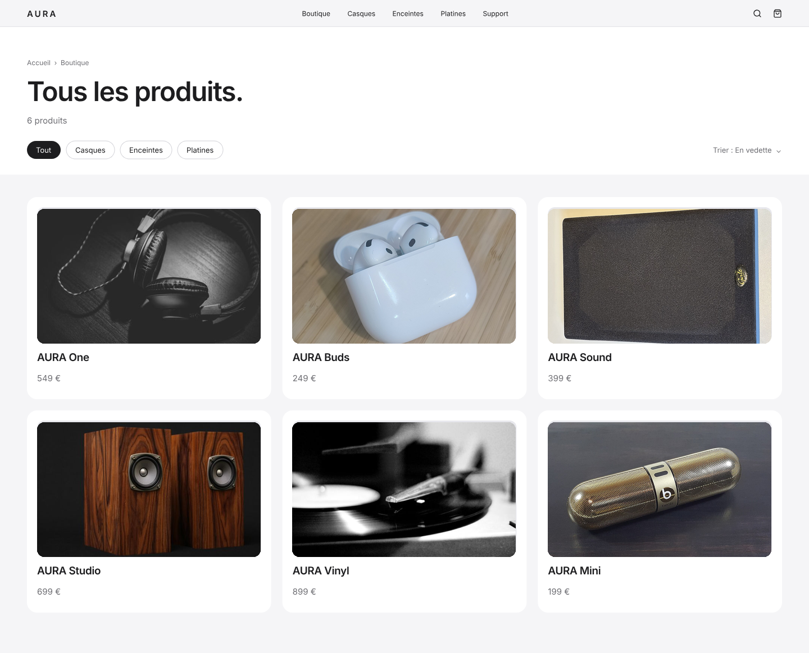
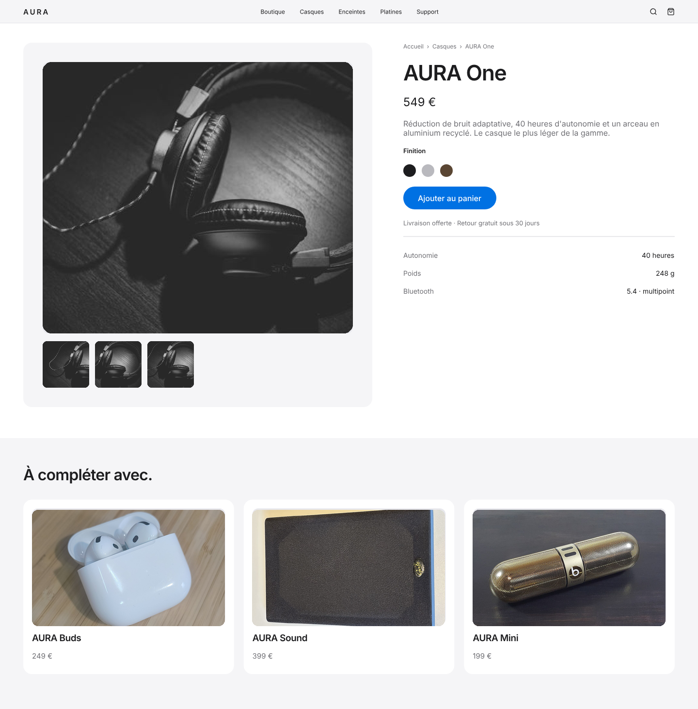

# ecommerce-aura — AURA

E-commerce de produits audio haut de gamme, en style **Apple minimaliste** :
fond blanc et gris clair, typographie serree, accent bleu unique, beaucoup de blanc.

## Les trois pages

| Fichier | Page | Contenu |
|---|---|---|
| `aura-accueil.png` | Accueil | heros, produits a la une, reassurance, pied de page |
| `aura-plp.png` | Liste produit | fil d'Ariane, filtres, tri, grille de six |
| `aura-pdp.png` | Fiche produit | galerie, finitions, appel a l'action, caracteristiques, produits lies |

## Direction

`#FFFFFF` et `#F5F5F7` pour les surfaces, `#1D1D1F` pour le texte, `#0071E3`
**uniquement** sur les actions. Inter partout, titres en gras avec interlettrage
negatif.

## Photos

| Emplacement | Auteur | Licence | Source |
|---|---|---|---|
| `hero` | anonyme | CC0 1.0 | [Headphones on Table](https://www.rawpixel.com/image/5969959/headphones-table) |
| `aura-one` | anonyme | CC0 1.0 | [black-and-white shot headphones wooden surface](https://www.rawpixel.com/image/3301986/free-photo-image-headphones-music-background) |
| `aura-buds` | Cheeseburgahhh | CC BY-SA 4.0 | [Fifth-generation AirPods in their charging case.jpg](https://commons.wikimedia.org/wiki/File:Fifth-generation_AirPods_in_their_charging_case.jpg) |
| `aura-sound` | Wikimedia Commons contributor | CC BY 4.0 | [Gale Silver Monitor Speaker Grille Front.jpg](https://commons.wikimedia.org/wiki/File:Gale_Silver_Monitor_Speaker_Grille_Front.jpg) |
| `aura-studio` | Phil Gradwell | BY 2.0 | [The Lance](https://www.flickr.com/photos/73228447@N02/23675580354) |
| `aura-vinyl` | Fabio Sola Penna | BY 2.0 | [Vinyl player](https://www.flickr.com/photos/21929919@N00/6439602217) |
| `aura-mini` | unmatched value | CC BY 2.0 | [Beats pill (28591413428).jpg](https://commons.wikimedia.org/wiki/File:Beats_pill_(28591413428).jpg) |

Le cadre de galerie de la fiche produit utilise le meme cliche recadre serre
(aigle, arceau, cable) : c'est un raccourci de maquette, a remplacer par de vrais
angles. La vignette « AURA Mini » montre un produit de marque visible.

## Apercu

### Accueil

### Liste produit

### Fiche produit

## Fichiers

- `design.pen` — source pen.dev, les trois pages dans un seul document
- `screenshots/aura-*.png` — rendus 1440 px de large
- `screenshots/aura-*.pdf` — memes rendus en PDF
