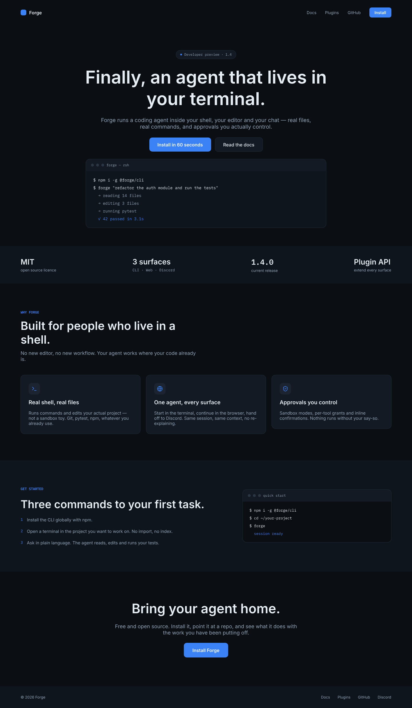

# forge-landing — Forge

Landing page pour **Forge**, un agent de code qui vit dans le terminal.

## Sections

navigation · heros (titre, double appel a l'action, panneau terminal) · bandeau de
preuve · trois arguments · demarrage rapide en trois etapes · appel a l'action
final · pied de page.

## Direction

Palette sombre technique. L'accent bleu `#3B82F6` n'apparait que sur les actions.
Titres en Inter, code et etiquettes en IBM Plex Mono.

## Apercu

## Photos

_Aucune photo tierce : cette maquette n'utilise que des formes et des degrades._

## Fichiers

- `design.pen` — source pen.dev
- `screenshots/forge-landing.png` — rendu 1440 px de large
- `screenshots/forge-landing.pdf` — meme rendu en PDF
