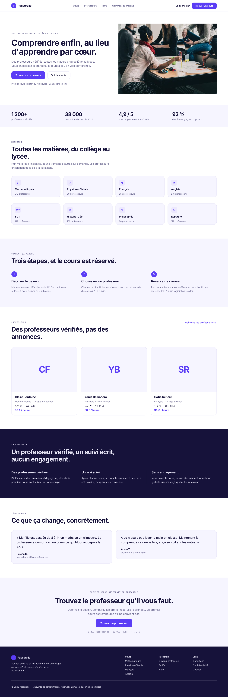
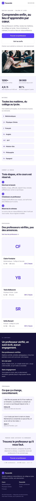
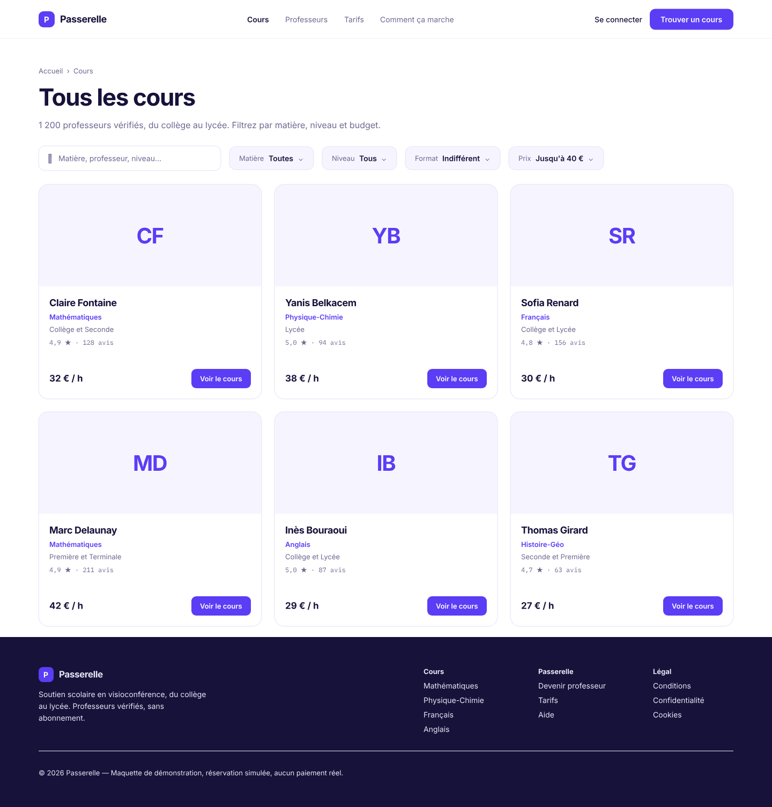
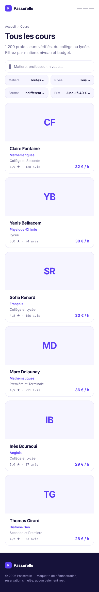
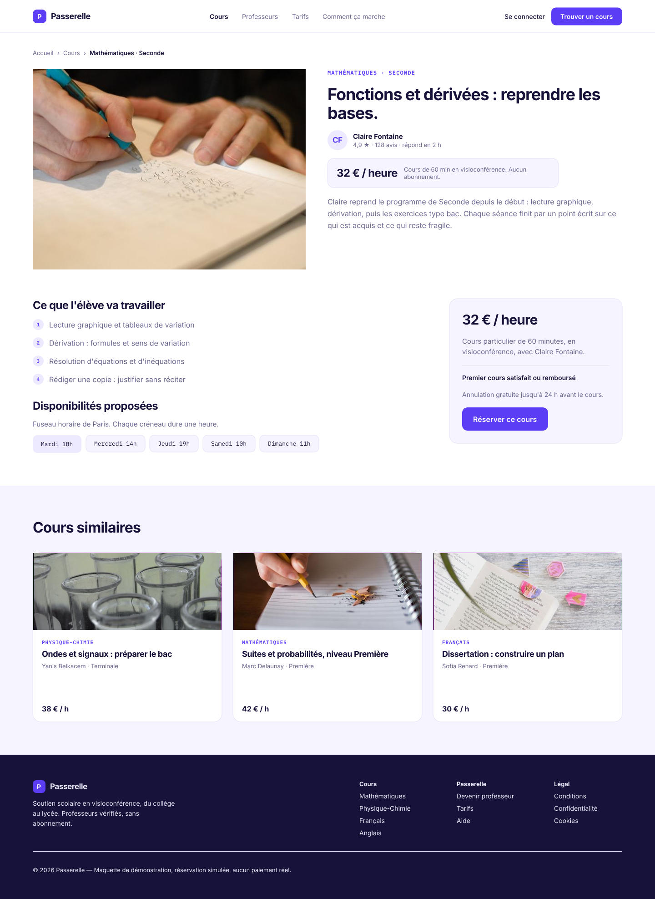
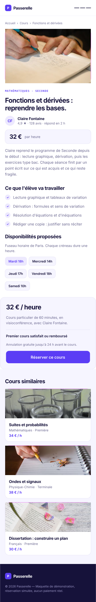
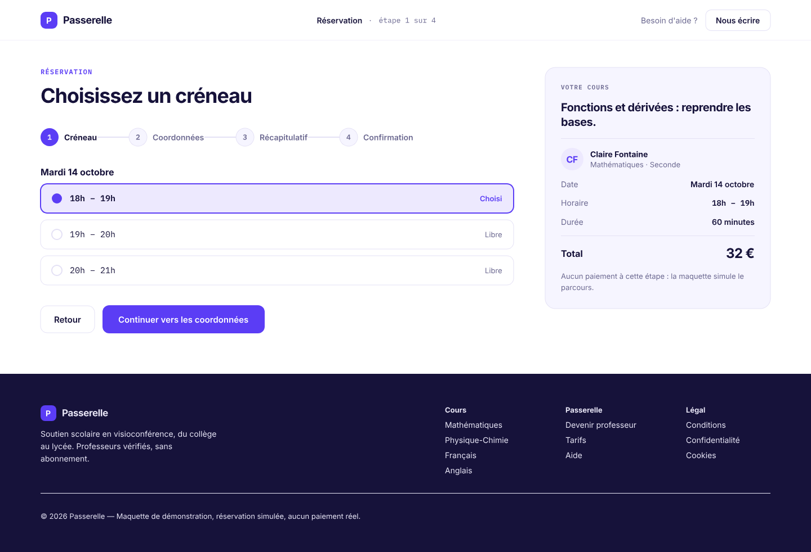
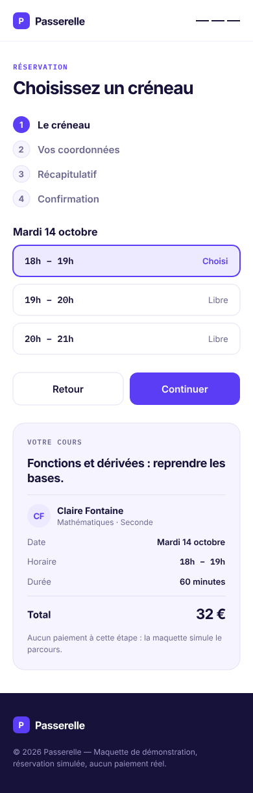

# passerelle — Passerelle

Plateforme de soutien scolaire : des professeurs vérifiés proposent des cours particuliers payants, du collège au lycée, toutes matières, réservables en ligne.

## Sections

accueil · liste des cours · fiche cours · réservation — chacune en 1440 px et en 390 px

## Direction

Violet unique #5B3DF5 réservé aux actions, Inter partout, IBM Plex Mono pour les surtitres. Alternance de sections claires pour expliquer et sombres pour crédibiliser.

## Apercu

### Accueil

### Accueil — mobile 390 px

### Liste des cours

### Liste des cours — mobile 390 px

### Fiche cours

### Fiche cours — mobile 390 px

### Réservation

### Réservation — mobile 390 px

## Photos

| Emplacement | Auteur | Licence | Source |
|---|---|---|---|
| `heros` | Brodie Vissers | CC0 1.0 | [People Girls](https://stocksnap.io/photo/people-girls-Y2AHVPYB51) |
| `similaire1` | The Wandering Angel | BY 2.0 | [Mouths](https://www.flickr.com/photos/86518301@N00/3664398844) |
| `fiche` | CarbonNYC [in SF!] | BY 2.0 | [Furiously Factoring](https://www.flickr.com/photos/15923063@N00/2965625438) |
| `similaire2` | Thought Catalog | CC0 1.0 | [Notebook Pencil](https://stocksnap.io/photo/notebook-pencil-LTY3TGLE73) |
| `similaire3` | Studio 7042 | CC0 1.0 | [Book Bookmark](https://stocksnap.io/photo/book-bookmark-4BR2JDSSA1) |

Vitrine : la réservation est un parcours simulé en quatre étapes, sans paiement ni enregistrement. Les cours, les tarifs, les avis et les témoignages sont représentatifs mais inventés. Les professeurs sont représentés par des monogrammes (CF, YB, SR, MD, IB, TG) et non par des portraits : la recherche d'images libres n'a pas donné de visages crédibles pour des enseignants — elle a renvoyé des militaires, un autel d'église et des enfants. Les pages mobiles ont été conçues, pas réduites : grilles en une colonne, cartes empilées, titres réduits, et un menu qui reste atteignable.

## Fichiers

- `design.pen` — source pen.dev
- `screenshots/accueil.png` — Accueil
- `screenshots/accueil-mobile.png` — Accueil — mobile 390 px
- `screenshots/liste-cours.png` — Liste des cours
- `screenshots/liste-cours-mobile.png` — Liste des cours — mobile 390 px
- `screenshots/fiche-cours.png` — Fiche cours
- `screenshots/fiche-cours-mobile.png` — Fiche cours — mobile 390 px
- `screenshots/reservation.png` — Réservation
- `screenshots/reservation-mobile.png` — Réservation — mobile 390 px
- `photos/` — photos sources et `CREDITS.json`
